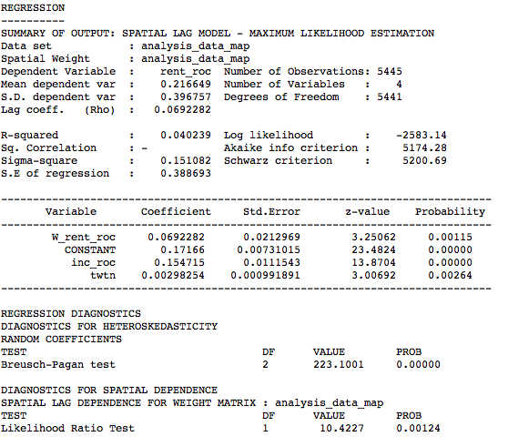

```{r setup, include=FALSE, echo=FALSE, include=FALSE}
knitr::opts_chunk$set(echo = TRUE)

library(rgdal)
library(readr)
library(tidyverse)
library("leaflet")
library(htmltools)
library(stringr)
library(spdep)
library(maptools)

```

This is my final project for the GIS class in the [Quantitative Methods in the Social Sciences program](http://www.qmss.columbia.edu/) at Columbia University. For my project, I decided to explore the relationship between tweeting and gentrification. 

I started the analysis with one independent variable (rate of change in rents between 2010 and 2015), one dependent variable (amount of tweets in an area) and two control variables (rate of change in education level and income in an area), but ended up dropping the control variable on education. Initially, I also performed my analysis on the level of subborrough areas. This proved problematic, as there are only a few dozen subborrough areas.

In this final version, I use block groups from the United States Tigerlines Census files and associated data on rents and income. The tweets were scraped during one day in November. While this only provided a few thousand tweets, the results from regressing the data at the block group level are encouraging. It seems like it would be worth exploring the connection of tweets to more established gentrification measurments with a bigger sample of tweets.

The hypothesis is that the amount of tweets in an area is positively related to the change in rents in an area. The null hypothesis is that no such relationship exists.

```{r initialize, message=FALSE, warning=FALSE, echo=FALSE, include=FALSE}

tweet_Counts <- readOGR(dsn="shapefiles/tweetCount_BG_WSG84.shp")
basemap <- readOGR(dsn="shapefiles/blockgroupsNY_2016_NoCP_JFK_WSG84.shp")

income2015 = read.csv("data/income_2015.csv", header = TRUE, sep = ",")
housing2015 <- read.csv2("data/housing_2015.csv", header = TRUE, sep = ",")
data2010 <- read.csv2("data/data_2010.csv", header = TRUE, sep = ",")

```


```{r process, echo=FALSE, message=FALSE, warning=FALSE, include=FALSE}

rent_income20102015 <- basemap
names(rent_income20102015)[names(rent_income20102015)=="GEOID"] <- "GEOID10"

data2010_cols <- data2010 %>%
  select(GEOID10, GEOID, income2010 = B19013e1, rent2010 = B25064e1)

income2015_cols <- income2015 %>%
  select(GEOID, income2015 = B19013e1)

housing2015_cols <- housing2015 %>%
  select(GEOID, rent2015 = B25064e1)

tweets_cols <- tweet_Counts@data %>%
  select(GEOID10 = GEOID, tweets, twts_ar100)

rent_income20102015 <- merge(rent_income20102015, data2010_cols, by="GEOID10")
rent_income20102015 <- merge(rent_income20102015, income2015_cols, by="GEOID")
rent_income20102015 <- merge(rent_income20102015, housing2015_cols, by="GEOID")
rent_income20102015 <- merge(rent_income20102015, tweets_cols, by="GEOID10")

rent_income20102015@data <- rent_income20102015@data %>%
  mutate(tweets_norm = 
           (as.numeric(as.character(tweets)) / as.numeric(as.character(ALAND)) 
            * mean(as.numeric(as.character(ALAND))))) %>%
  mutate(tweets_norm_map = tweets_norm)

```

```{r roc, echo=FALSE, message=FALSE, warning=FALSE, include=FALSE}

# Creating function to get rate of change for data
rateOfChange <- function(data, year1, year2) {
  change <- (data[,year2] - data[,year1]) / data[,year1] 
  change_perc <- change*100
  data[ , "rate_of_change"] <- change
  return(data)
}

# Getting rates of change using my above created function
rent_income20102015@data <- rateOfChange(rent_income20102015@data, "income2010", "income2015")
names(rent_income20102015)[names(rent_income20102015)=="rate_of_change"] <- "inc_roc"

rent_income20102015@data <- rateOfChange(rent_income20102015@data, "rent2010", "rent2015")
names(rent_income20102015)[names(rent_income20102015)=="rate_of_change"] <- "rent_roc"

# Create labels to show name of subborough area and rate of change of variable being explored.
rent_income20102015@data <- rent_income20102015@data %>%
  mutate(rents_label = as.character(round(rent_roc, 2))) %>%
  mutate(tweets_label = as.character(round(tweets_norm_map, 2))) %>%
  mutate(income_label = as.character(round(inc_roc, 2)))

rent_income20102015$tweets_norm_map[is.na(rent_income20102015$rent_roc)] <- NA
rent_income20102015$tweets_norm_map[rent_income20102015$tweets_norm_map == 0] <- NA

rent_income20102015_toGEODA <- rent_income20102015
rent_income20102015_toGEODA@data <- rent_income20102015@data %>%
  select(GEOID10, GEOID, inc_roc, rent_roc, tweets_norm)
names(rent_income20102015_toGEODA)[names(rent_income20102015_toGEODA)=="tweets_norm"] <- "twtn"

writeOGR(rent_income20102015_toGEODA, "analysis_data_map.shp", driver="ESRI Shapefile", layer = "rent_income20102015")

```

## Mapping

First, I want to explore how the data looks like when mapping to block groups instead of subborrough areas. For this, I preprocess the tweets in a few steps, normalizing them for the size of each census block group by dividing the amount of tweets in a block group by the area of the block group and then multiplying this results with the mean of the block group areas. I also calculate the rate of change in income and rent between 2010 and 2015. This produces the following set of leaflet maps:

```{r maps, echo=FALSE, message=FALSE, warning=FALSE, include=TRUE}

# Mapping rates of change.
map <- leaflet(rent_income20102015) %>% 
  setView(lng = -74.0060, lat = 40.7128, zoom = 11) %>%
  addProviderTiles(providers$CartoDB.PositronNoLabels) %>%
  addPolygons(color = "#444444", weight = 1, smoothFactor = 0.5,
              opacity = 1.0, fillOpacity = 0.9,
              fillColor = ~colorQuantile("YlGnBu", rent_roc)(rent_roc),
              highlightOptions = highlightOptions(color = "white", weight = 2,
                                                  bringToFront = TRUE),
              group = "Rents",
              label = ~htmlEscape(rents_label)) %>%
  addPolygons(color = "#444444", weight = 1, smoothFactor = 0.5,
              opacity = 1.0, fillOpacity = 0.9,
              fillColor = ~colorQuantile("YlGnBu", inc_roc)(inc_roc),
              highlightOptions = highlightOptions(color = "white", weight = 2,
                                                  bringToFront = TRUE),
              group = "Income",
              label = ~htmlEscape(income_label)) %>%
  addPolygons(color = "#444444", weight = 1, smoothFactor = 0.5,
              opacity = 1.0, fillOpacity = 0.9,
              fillColor = ~colorQuantile("YlOrRd", 
                                         tweets_norm_map, 
                                         na.color = "White")(tweets_norm_map),
              highlightOptions = highlightOptions(color = "white", weight = 2,
                                                  bringToFront = TRUE),
              group = "Tweets",
              label = ~htmlEscape(tweets_label)) %>%
  addLayersControl(
    baseGroups = c("Rents", "Income", "Tweets"),
    options = layersControlOptions(collapsed = FALSE)
  )

# Outputting map
map

```

## Regression models

The takeaway from the maps is that it looks like there might be a relationship between the rates of change of income and rent to tweeting, as some areas like Brooklyn around Williamsburg and Bedstuy look like they are in the upper parts of the value distributions for all three variables. An Ordinary Least Squares regression confirms that some kind of relationship might exist. Between tweets and the rate of change of income, the control variable seems to explain more of the variation in the independent variable. Nonetheless, there is a weak but statistically significant positive relationship between the amount of tweets in a block group and the rate of change of rents during the past five years.

```{r ols, message=FALSE, warning=FALSE, echo=FALSE}
#start by running a linear regression
model_ols <- lm(rent_roc ~ inc_roc + twtn, 
            data = rent_income20102015_toGEODA@data, na.action = na.exclude)

#print results
summary(model_ols)
```

```{r queen_weights, message=FALSE, warning=FALSE, include=FALSE}
#Create queens contiguous weights matrix
list_queen <- poly2nb(rent_income20102015_toGEODA, queen=TRUE)
W <- nb2listw(list_queen, style="W", zero.policy=TRUE)

```

I then proceeded to create a weights matrix, which can in turn be uses to get the the global [Moran’s I](https://en.wikipedia.org/wiki/Moran%27s_I) to see how on average the relationship between a given polygon and its neighbours is different from what one would expect under spatial randomness. 

For the basic OLS model, the global value of Moran’s I is 0.02017342 and highly statistically significant with a p-value of 0.01403. This indicates that the spatial autocorrelation of residuals is almost random and there is no clear clustering of similar values. The reason for this might be my limited Twitter data, with values of zero for the majority of block groups. This also caused a problem when looking for quantiles in the data, as more than one quantile was simply zero. As overall variance in the Twitter data is low, there is little room for spatial autocorrelation patterns to emerge.

```{r diagnostics, message=FALSE, warning=FALSE, echo=FALSE}
#Test for spatial dependence using Moran's I
model_ols_for_moran <- lm(rent_roc ~ inc_roc + twtn, 
            data = rent_income20102015_toGEODA@data)
moran_lm <- lm.morantest(model_ols_for_moran , W, alternative="two.sided", zero.policy = TRUE)
print(moran_lm)

#Test for other diagnostics for dependence
LM <- lm.LMtests(model_ols_for_moran , W, test="all", zero.policy = TRUE)
print(LM)

```

The spatial lag and error models test for spatial autocorrelation in the linear model using two different approaches. The spatial lag model includes a spatial weights matrix multiplied with the dependent variable in the linear model, creating bias and inconsistency. I initially tried to obtain these values using R, but RStudio kept crashing when running either the spatial lag or spatial error models. I thus ran them in [GeoDa](https://geodacenter.github.io/), saving the regression coefficients and related parameters as images and importing the residuals as a shapefile.

For my spatial lag model, the results were the following:



Here, the z-value indicates distance to the mean as measured in standard deviations. A high z-value combined with a low p-value indicates that it is unlikely that the observation follows a random spatial pattern. Income and tweets have low p-values and fairly or very high z-values. The coefficient for income is fairly high and positive but extremely small for tweets.

The spatial error model, on the other hand, operates by including the weights matrix in the error term. The z-value, p-value and coefficients are similar to the lag model, but slightly smaller. The spatial lag model seems to be a better fit, which is further verified when we look at the residual mean square error below. 


Finally, the residuals maps show the difference between the observed and the fitted data. The smaller the residuals, the better the fit. The residual mean squared error is one measurement of the quality of the fit. For OLS, it is 0.3892337, for the spatial lag mdoel 0.3843643 and for the spatial error model 0.3843643. Following this criteria, the best fit is provided by the spatial lag model, although the differences are neglible. In the spatial lag (and the two other) models, the tweets have a statistically significant positive relationship to the rate of chagne in rent between 2010 and 2015. 

The size of the coefficient is small, but a larger sample of tweets might increase this value. Hence, we can reject the null hypothesis of no relationship existing: there is indication of a weak relationship, that would be worth exploring in further research.

Residual map for OLS:

```{r load_residual_data, message=FALSE, warning=FALSE, echo=FALSE, include=FALSE}

GEODA_data <- readOGR(dsn="shapefiles/analysis_data_RESIDUALS.shp")

```

```{r residuals_ols, message=FALSE, warning=FALSE, echo=FALSE}
#extract residuals for ols model and lag model

rent_income20102015@data$ols_res <- resid(model_ols) #residuals ols
rent_income20102015 <- merge(rent_income20102015, GEODA_data@data, by="GEOID10")

#view residuals for linear model
require(RColorBrewer)
qpal<-colorQuantile("OrRd", rent_income20102015@data$ols_res, n=9) 

ols_res_map <- leaflet(rent_income20102015) %>%
  setView(lng = -74.0060, lat = 40.7128, zoom = 11) %>%
  addProviderTiles(providers$CartoDB.PositronNoLabels) %>%
  addPolygons(stroke = FALSE, color = ~qpal(ols_res), smoothFactor = 0.2,
              opacity = 1.0, fillOpacity = .8,
              highlightOptions = highlightOptions(color = "white", weight = 2,
                                                  bringToFront = TRUE),
              label = ~htmlEscape(as.character(ols_res)))

ols_res_map

```

Residual map for spatial lag:

```{r residuals_lag, message=FALSE, warning=FALSE, echo=FALSE}
#compare with residuals for lag model
qpal<-colorQuantile("OrRd", rent_income20102015@data$LAG_RESIDU, n=9) 

sar_res_map <- leaflet(rent_income20102015) %>%
  setView(lng = -74.0060, lat = 40.7128, zoom = 11) %>%
  addProviderTiles(providers$CartoDB.PositronNoLabels) %>%
  addPolygons(stroke = FALSE, color = ~qpal(LAG_RESIDU), smoothFactor = 0.2,
              opacity = 1.0, fillOpacity = .8,
              highlightOptions = highlightOptions(color = "white", weight = 2,
                                                  bringToFront = TRUE),
              label = ~htmlEscape(as.character(LAG_RESIDU)))

sar_res_map 

```